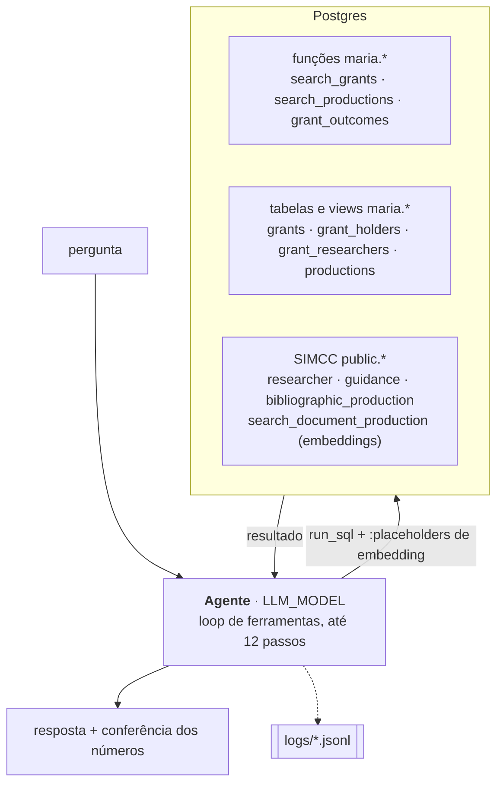
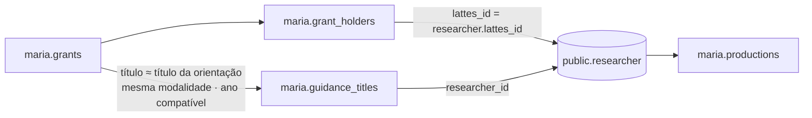

# Arquitetura

## Objetivo

Responder pelo terminal a perguntas como:

> As bolsas contemplam pesquisas na temática Dengue? Se sim, qual o resultado
> desse fomento? Ele gerou artigos? livros? capítulos? de quem, quando e quantos

Isso exige quatro coisas:

1. **Busca temática nas bolsas**, por palavra-chave e por semântica.
2. **Ligação da bolsa a pesquisadores do SIMCC**, seja o bolsista ou o
   orientador.
3. **Produção desses pesquisadores**, dentro de uma janela de tempo e sobre o
   mesmo tema.
4. **Agregação sem contar duas vezes**: uma bolsa pode ter vários bolsistas, e
   uma obra aparece uma vez por coautor.

## Visão geral



A lógica que define **o que conta** como correto fica no banco, em funções e
views determinísticas e testáveis. O LLM decide **quais perguntas fazer ao
banco** e como agregar e apresentar o resultado. Assim, regras críticas como
"uma bolsa pode ter vários bolsistas" e "uma obra conta uma vez" não dependem
de o modelo acertar um JOIN complexo.

## Busca híbrida (lexical + semântica)

Toda busca por similaridade combina dois métodos. **Cada um tem a própria
linha de corte**, e o resultado é a **união** dos dois:

```
mantém o candidato se   lexical ≥ LEXICAL_MIN   OU   semantic ≥ SEMANTIC_MIN
score = LEXICAL_WEIGHT · lexical + SEMANTIC_WEIGHT · semantic
match_method = lexical | semantic | both
```

| Uso | Lexical | Semântico |
|---|---|---|
| **Tema nas bolsas** (`search_grants`) | o termo aparece (início de palavra, sem acento) em título, resumo ou palavras-chave → 1/0 | cosseno entre o embedding da pergunta e o de título + resumo + palavras-chave |
| **Tema nas produções** (`search_productions`) | o termo aparece no título | cosseno com o embedding do SIMCC (`search_document_production`) |
| **Bolsa → orientador** (`grant_advisor_links`) | similaridade de trigramas (`pg_trgm`) entre os títulos | cosseno entre o embedding do título da bolsa e o do título da orientação |

!!! note "Candidatos da ligação bolsa → orientador"
    Comparar cada bolsa com as 158 mil orientações por trigramas levaria horas
    (~150 ms por bolsa, mesmo com índice GIN). Por isso, os **candidatos** de
    cada bolsa são as orientações de **título idêntico** mais os **20 títulos
    mais próximos no índice HNSW** (`LINK_CANDIDATES`). Sobre os candidatos,
    as **duas** notas são calculadas, e cada método aplica a própria linha de
    corte. Um título com trigramas ≥ 0,80 é quase idêntico e cai entre os
    vizinhos mais próximos, então a perda é teórica.

### Calibração (05/10/2026)

**Tema.** A escala do cosseno depende do texto embedado. Com `"dengue"`, o
corte de 0,40 traz 6 bolsas sem a palavra, todas de temas vizinhos
(chikungunya, arboviroses, *Aedes*). Com uma frase longa ("dengue e outras
arboviroses transmitidas pelo *Aedes aegypti*"), o mesmo corte traz mais de
340 bolsas, com muito ruído. Por isso, o prompt exige que o texto embedado seja
**o nome curto do tema**. Muitas bolsas que citam "dengue" ficam abaixo de
0,40: a parte lexical é indispensável.

**Ligação com o orientador.** Os casos aprovados só pela semântica (≥ 0,90)
são quase todos o mesmo projeto com título abreviado (ex.: "*Moniliophthora
perniciosa*" ↔ "*M. perniciosa*"). Os aprovados só pela parte lexical incluem
projetos "irmãos" do mesmo grupo (ex.: "*Rhinella hoogmoedi*" ↔ "*Rhinella
crucifer*", 0,83), que costumam ter o mesmo orientador. O embedding diferencia
maiúsculas e minúsculas ("ANÉIS E MÓDULOS" ↔ "Anéis E Módulos" dá 0,63), o que
subestima a nota semântica de títulos em CAIXA ALTA. Uma melhoria possível é
vetorizar os títulos em minúsculas.

Os valores padrão e as variáveis de ambiente estão em
[Pipeline › Parâmetros](../dados/pipeline.md#parametros-env). A coluna
`match_method` / `link_method` sempre diz por qual método cada item entrou, e
a resposta informa essa distribuição.

!!! note "Cobertura semântica das produções"
    Só artigos, livros e capítulos com documento em `search_document_production`
    têm embedding (131 mil de 295 mil). Os demais só são encontrados pelo método
    lexical.

## Ligação bolsa → pesquisador



- **`holder`:** o próprio bolsista está no SIMCC. A ligação é declarada pelo
  Lattes.
- **`advisor`:** existe uma orientação no SIMCC com título equivalente ao da
  bolsa, mesma modalidade (IC ↔ Iniciação Científica, Mestrado ↔ Dissertação,
  Doutorado ↔ Tese) e ano entre o início − 1 e o fim previsto + 2. A ligação é
  **inferida**, e a evidência fica em `maria.grant_advisor_links`.

## Resultado do fomento: `maria.grant_outcomes`

Para um tema, a função devolve uma linha por **(bolsa, pesquisador,
produção)** em que:

1. a bolsa casa com o tema;
2. o pesquisador está ligado à bolsa (`holder` ou `advisor`);
3. a produção é artigo, livro ou capítulo do pesquisador, publicada entre o
   ano de início da bolsa e o ano de término + `OUTCOME_YEARS_AFTER`;
4. a produção também casa com o tema.

**Uma obra pode aparecer em várias linhas** (várias bolsas, vários
pesquisadores, um registro por coautor no SIMCC). Contamos obras com
`count(DISTINCT work_key)`, em que `work_key` é o DOI ou, sem DOI, o título
normalizado + ano.

## O agente

`src/simcc_maria/agent.py`

- **Modelo:** `gpt-5.5-2026-04-23` via **Responses API** (`use_responses_api`).
  Nesse modelo, a OpenAI só aceita ferramentas com `reasoning_effort` nessa API.
- **Uma ferramenta:** `run_sql(purpose, sql, embed[])`, que executa um SELECT
  somente leitura. Placeholders `:nome` no SQL são trocados pelo embedding do
  texto informado em `embed`, gerado com o mesmo modelo do SIMCC e guardado em
  cache.
- **Vários passos:** o modelo pode explorar, conferir títulos e agregar antes
  de responder, até `AGENT_MAX_STEPS` (15). O prompt pede economia: de 4 a 6
  consultas, com vários números por consulta. No limite, ele é obrigado a
  responder com o que tem e a dizer o que não conseguiu verificar.
- **Prompt de sistema** (`catalog.py`): descrição dos objetos, números de
  referência da base (lidos do banco na inicialização), as regras de contagem
  e o formato da resposta.
- **Conferência:** todo número citado na resposta precisa aparecer no
  resultado de algum passo. Os que não aparecem são marcados com ⚠.

### Regras de contagem no prompt

1. **Bolsa ≠ bolsista.** Bolsas são `count(DISTINCT grant_id)`. Bolsistas
   (pessoas) são `count(DISTINCT lattes_id)` + bolsistas sem Lattes. Vínculos
   são as linhas de `grant_holders`.
2. **Nunca contar linhas de um JOIN.** Sempre `count(DISTINCT …)` sobre a
   entidade contada.
3. **Obras contam por `work_key`.**
4. **Cobertura:** dizer quantas bolsas do tema têm algum pesquisador ligado,
   para que "nenhuma produção encontrada" não seja lido como "nenhuma
   produção".
5. **Instituições:** agrupar pela sigla, que tem um nome canônico.

## Auditoria

Usamos um JSONL por sessão em `logs/`. O cabeçalho (`session_start`) guarda
todos os parâmetros (modelo, linhas de corte, pesos, janelas), o prompt
completo, o hash dos dados e o commit. Depois vêm um evento `step` por
consulta (propósito, SQL, textos embedados, linhas, amostra, erro) e um
`answer` por resposta (texto, números não conferidos, tokens, tempo).

```python
import polars as pl
log = pl.read_ndjson("logs/*.jsonl", infer_schema_length=None)
log.filter(pl.col("event") == "step").select("turn", "step", "purpose", "sql", "rows")
```
