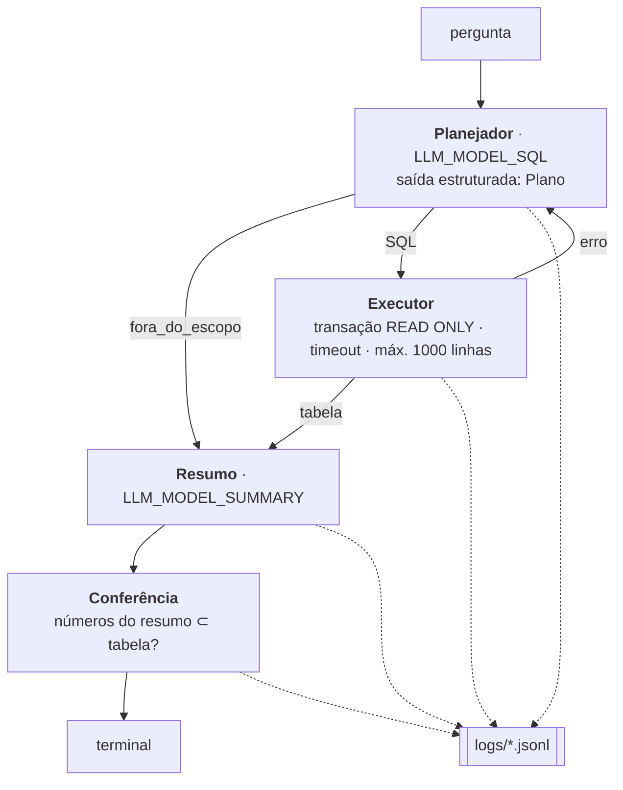

# Arquitetura

## Objetivo

Validar, **pelo terminal**, que um LLM recebe uma pergunta em português sobre
a [planilha do CNPq](../dados/visao-geral.md) e devolve **uma listagem** ou
**uma agregação com resumo**, com números corretos. O [SIMCC](../dados/simcc.md)
entra depois, como complemento. Para rodar, veja [Como usar](uso.md).

## Por que text-to-SQL, e não self-query

O `SelfQueryRetriever` transforma a pergunta em
`(texto para busca semântica, filtros)` e devolve os **k documentos mais
parecidos**. Ele não conta nem agrupa.

| Pergunta | Self-query | Text-to-SQL |
|---|---|---|
| "Pesquisadores de Física da UFMG nível A" | ✅ limitado a k resultados | ✅ |
| "Quantas bolsas DT por região?" | ❌ | ✅ `GROUP BY` |
| "Top 10 instituições do Nordeste" | ❌ | ✅ |
| "Bolsistas que publicam sobre mudanças climáticas" | ✅ | ❌ (precisa dos embeddings do SIMCC) |

A planilha é 100% estruturada, então quase tudo vira SQL. A busca semântica
fica para o texto do SIMCC (fase 2).

## Fluxo



Usamos **um fluxo explícito, e não um agente genérico com tools**. Cada etapa
tem entrada e saída definidas, e isso deixa o log legível e os erros
localizáveis.

| Etapa | Arquivo | Detalhes |
|---|---|---|
| Plano | `pipeline.py` | `Plano(tipo, sql, premissas, ressalvas)` via `with_structured_output`. `tipo` ∈ listagem · agregacao · fora_do_escopo |
| Contexto | `pipeline.py` · `catalog.py` | O prompt de sistema é gerado na inicialização: descrição de cada coluna, valores distintos das colunas categóricas (lidos do banco), as 94 áreas e as regras de negócio |
| Execução | `db.py` | Pool asyncpg com `search_path=maria,public` e `default_transaction_read_only=on`. `prepare()` rejeita múltiplos comandos. Se o SQL falhar, o erro volta ao planejador (até 3 tentativas) |
| Resumo | `pipeline.py` | Recebe a pergunta, as premissas, as ressalvas e até 50 linhas. É instruído a citar só números presentes na tabela e a não repetir a tabela |
| Conferência | `pipeline.py` | Extrai os números do resumo (formato BR) e verifica se cada um existe na tabela, aceitando arredondamento. Os que não existem aparecem como ⚠ |
| Memória | `pipeline.py` | As últimas 5 trocas (pergunta + plano + amostra) dão contexto a perguntas como "e no Sul?" |

### Regras de negócio no prompt

Elas ficam em `catalog.py` (`RULES`) e respondem a armadilhas reais da base:

- **"Bolsistas" contam pessoas, "bolsas" somam bolsas.** Bolsistas é
  `count(DISTINCT id_lattes)` e bolsas é `sum(qtd_bolsa)`.
- **Termo de área que existe exatamente na base usa `=`; caso contrário,
  `ILIKE`.** Sem essa regra, "Física" às vezes incluía "Biofísica".
- **Sigla de instituição só casa no fim do nome** (`instituicao ~ '\mUSP$'`).
  Com `ILIKE '%USP%'`, o resultado incluía o HCFMUSP, e a mesma pergunta
  dava 59 ou 60 conforme a execução.
- **Texto livre passa por `unaccent(...) ILIKE`**, porque cidade e UF estão
  sem acento.
- **As escalas de nível nunca são somadas** (1A–2 contra A–C).
- **Percentuais e totais são calculados no SQL**, nunca estimados pelo
  modelo.

### Modelos

| Etapa | Padrão | Por quê |
|---|---|---|
| SQL | `gpt-5.5-2026-04-23`, raciocínio `medium` | É onde ocorrem os erros que importam (número errado com cara de certo) |
| Resumo | o mesmo modelo, raciocínio `low` | Ponto de partida. Trocar por um modelo menor só depois de medir com `evaluate` |

Usamos **snapshots datados**, para que o modelo não mude entre execuções
auditadas.

## Resultados da avaliação

Todos os resultados abaixo são de 05/10/2026, com `gpt-5.5-2026-04-23` nas
duas etapas e 16 casos.

| Rodada | Resultado | O que mudou depois |
|---|---|---|
| 1× | 16/16 | — |
| 3× (consistência) | 47/48 | `senior_usp` variou entre 59 e 60 (sigla por substring). O resumo vazou uma instrução do prompt. As duas regras foram corrigidas |
| 2× | **32/32**, sem números não conferidos | ~3.000 tokens e 4–8 s por pergunta |

As falhas foram encontradas lendo o log de auditoria
(`pl.read_ndjson("logs/*_eval_*.jsonl")`), que é justamente o uso previsto
para ele.

## Banco: Postgres como motor único

O SIMCC já está em Postgres com pgvector, e o DuckDB não executa os
operadores vetoriais. A planilha fica no schema `maria`, separado das
tabelas do SIMCC. A tabela é carregada por `poetry run load-db`, e as
descrições das colunas viram `COMMENT ON COLUMN`. Assim o LLM gera um único
dialeto SQL e o JOIN com o SIMCC fica a um `lattes_id` de distância.

## Auditoria

Usamos **um arquivo JSONL por sessão** em `logs/`, sem nenhum serviço
externo. Nomes: `<data>_<chat|eval>_<sessão>.jsonl`.

| Evento | Conteúdo |
|---|---|
| `session_start` | modelos, esforço de raciocínio, **prompt de sistema completo** + hash, hash do CSV, commit git |
| `question` | texto da pergunta |
| `plan` | tipo, SQL, premissas, ressalvas, tentativa, modelo |
| `sql_error` | SQL e erro (quando o banco rejeita) |
| `sql_result` | linhas, truncado?, ms, colunas, amostra de 20 linhas |
| `summary` | texto e modelo |
| `answer` | texto final, números não conferidos, tokens, latência total |
| `command` / `export` | comandos `/` e exportações CSV |
| `eval_case` | caso, rodada, ok, detalhe (na avaliação) |

Para analisar:

```python
import polars as pl

log = pl.read_ndjson("logs/*.jsonl")
log.filter(pl.col("event") == "sql_error")           # SQL que falhou
log.filter(pl.col("unverified_numbers").list.len() > 0)  # resumos suspeitos
```

| Alternativa | Por que não agora |
|---|---|
| LangSmith | Serviço externo: perguntas e dados saem da máquina |
| Langfuse (self-hosted) | Interface ótima, mas exige subir Docker com vários serviços |
| MLflow tracing | `autolog()` em uma linha e interface local. É a melhor opção se você sentir falta de uma interface |

## Fase 2: SIMCC (não implementada)

1. Uma etapa/tool **`busca_semantica`** vetoriza a pergunta com
   `text-embedding-3-small` (o mesmo modelo que gerou os embeddings) e ordena
   `search_document_*` por `<=>`.
2. O planejador ganha um tipo novo (por exemplo, `semantica`) e o JOIN
   `maria.bolsas.id_lattes = researcher.lattes_id`.
3. As respostas que cruzam as bases avisam da cobertura de ~2,5% (os
   bolsistas que estão no SIMCC são quase todos da Bahia).
