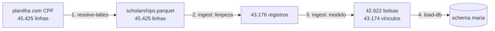

# Limpezas e transformações

Registro de **tudo o que foi alterado** entre a planilha recebida e as tabelas
que o chatbot consulta, com a contagem de cada mudança. A ordem é a de
execução. O código de cada etapa está indicado; os testes estão em
`tests/test_core.py`.



## 1. CPF → Lattes (`resolve_lattes.py`, 05/10/2026)

| Transformação | Afetados |
|---|---:|
| CPF com zeros à esquerda perdidos no Excel, completado para 11 dígitos | 1 linha |
| Documento estrangeiro (`US…`, `IT…`), não consultado | 3 linhas |
| CPF trocado por Lattes ID (uma requisição por CPF distinto) | 32.947 CPFs |
| Lattes não encontrado na API, após duas rodadas | 105 linhas (91 CPFs) |
| CPF/RG digitado em texto livre, mascarado (`[CPF removido]`, `[RG removido]`) | 3 células |
| Coluna `cpf_pesquisador` removida | todas |

A planilha original e o cache (hash do CPF → Lattes) foram **apagados**,
inclusive do histórico do Git. Detalhes no `README.md`.

## 2. Padronização para inglês

| Transformação | Detalhe |
|---|---|
| Nomes de coluna | `Titulo do Projeto` → `title`, `Data Final_1` → `planned_end_date`… (mapa em `ingest.SOURCE_COLUMNS`) |
| `lattes_status` | `ok` → `found`, `nao_encontrado` → `not_found`, `documento_estrangeiro` → `foreign_document` |
| Arquivo | `bolsas_projetos.parquet` → `scholarships.parquet` |

Os **valores** de texto (títulos, resumos, áreas, instituições) continuam no
original, em português.

## 3. Limpeza de valores (`ingest.load_scholarships`)

### Espaços e valores vazios

| Transformação | Afetados |
|---|---:|
| Espaços no início/fim removidos | 9.299 células |
| Texto vazio convertido em nulo | ver tabela abaixo |

| Coluna | Vazios → nulo |
|---|---:|
| `abstract` | 94 |
| `keyword_1` / `keyword_2` / `keyword_3` / `keyword_4` | 98 / 105 / 6.634 / 19.291 |
| `unit` / `unit_zip` | 3.278 / 3.278 |
| `department` / `department_zip` | 21.491 / 21.790 |
| `course` | 32.820 (nunca preenchido em IC) |
| `major_area` / `area` | 61 / 61 |
| `institution_zip` | 1 |
| `subarea` | 45.425: **coluna removida** (sempre vazia) |

### Datas

| Verificação | Resultado |
|---|---:|
| `dd/mm/aaaa` convertidas para `date` | 3 colunas, **0 falhas** |
| Término antes do início | 0 |
| Término efetivo antes do previsto | 2.062 registros (mantidos: encerramento antecipado) |
| Término efetivo **depois** do previsto | 1 registro (mantido como está) |

### Modalidade

O rótulo original foi mantido em `modality_label`, e `modality` recebeu um
código:

| Rótulo | `modality` |
|---|---|
| Iniciação Científica - Cotas | `undergraduate_research` |
| Mestrado - Cotas | `masters` |
| Mestrado Profissional - Cotas | `professional_masters` |
| Doutorado - Cotas | `doctorate` |

### Instituições (`ingest.canonical_institutions`)

| Transformação | Afetados |
|---|---:|
| Sigla `UFSB` → `UFSBA` (mesma instituição) | 1 registro |
| Nome trocado pela grafia mais frequente da sigla | 539 registros |

| Sigla | Grafias | Registros renomeados |
|---|---:|---:|
| UESB | 2 | 261 |
| UCSAL | 2 | 197 |
| IFBA | 5 | 66 |
| UNILAB | 2 | 15 |

Sem isso, agrupar por nome dividia a mesma instituição em várias linhas. A
avaliação do chatbot detectou o problema (UESB: 317 + 15 bolsas de doutorado
em vez de 332).

## 4. Duplicatas e modelo de bolsas (`ingest.build`)

### Cópias exatas

| | Registros |
|---|---:|
| Linhas idênticas em todas as colunas | 4.206, em 1.957 grupos (até 6 cópias) |
| **Removidas** (mantida uma por grupo) | **2.249** |
| Registros distintos restantes | 43.176 |

Nada se perde: `grant_holders.source_rows` guarda quantas linhas da planilha
cada vínculo representa, e a soma é exatamente 45.425.

### Bolsa (`grant`)

A planilha não tem identificador de bolsa. Os registros foram agrupados pela
chave:

```
título normalizado + resumo normalizado + modalidade + sigla da instituição + data final prevista
```

"Normalizado" significa em minúsculas e com espaços colapsados. O
`grant_id` é o hash SHA-1 dessa chave, e é estável entre execuções.

| | Valor |
|---|---:|
| Registros | 43.176 |
| **Bolsas** | **42.622** |
| Bolsas com 2 bolsistas / 3 bolsistas | 536 / 8 |

Quando os registros de uma bolsa diferem, os atributos da bolsa são
consolidados assim:

| Atributo | Regra | Bolsas em que variava |
|---|---|---:|
| `start_date` | menor início entre os bolsistas | — |
| `end_date` | maior término entre os bolsistas | — |
| `keywords` | união das palavras-chave (sem repetição) | — |
| `area` | valor mais frequente (empate: ordem alfabética) | 66 |
| `major_area` | valor mais frequente (empate: ordem alfabética) | 27 |
| `institution` | já canônico por sigla | 0 |

### Vínculo bolsa–bolsista (`grant_holder`)

| Regra | Afetados |
|---|---:|
| Um vínculo por (bolsa, Lattes) | — |
| Registros da mesma pessoa na mesma bolsa com detalhes diferentes, unidos (datas mín./máx.; unidade, departamento e curso pelo mais frequente) | 2 pares |
| Bolsista sem Lattes: cada registro vira um vínculo próprio, contado como pessoa diferente | 103 vínculos |
| **Total de vínculos** | **43.174** |

`holder_seq` numera os bolsistas de cada bolsa pela data de início.

## 5. Preparação para busca (`load_db.py`)

| Transformação | Detalhe |
|---|---|
| `title_norm`, `search_text` | `maria.norm()`: minúsculas, sem acento, pontuação → espaço. Usados na busca lexical |
| Embeddings | título e título + resumo + palavras-chave de cada bolsa (`text-embedding-3-small`); textos cortados em 8.000 caracteres |

## 6. Dados do SIMCC usados nas ligações (`load_db.py`)

### Orientações (`maria.guidance_titles`)

| Filtro | Orientações |
|---|---:|
| Total em `public.guidance` | 422.860 |
| Natureza sem modalidade de bolsa correspondente (TCC, especialização, outra natureza, pós-doc) | −260.163 |
| Título com menos de 10 caracteres | −430 |
| Ano anterior a 2003 | −4.248 |
| **Mantidas** | **158.018** |

| Grupo | Naturezas (grafias variam no SIMCC) | Orientações |
|---|---|---:|
| `undergraduate_research` | Iniciação Científica | 85.366 |
| `masters` | Dissertação de Mestrado | 53.838 |
| `doctorate` | Tese de Doutorado | 18.814 |

### Produções (`maria.productions`)

| | Valor |
|---|---:|
| Tipos mantidos | artigo, livro, capítulo (trabalhos em eventos e textos em jornais ficam de fora) |
| Registros | 295.095 |
| **Obras distintas** (`work_key` = DOI, ou título normalizado + ano) | **230.744** |

A diferença vem dos coautores: o SIMCC repete a obra para cada autor
cadastrado. Toda contagem de obras usa `count(DISTINCT work_key)`.

## O que **não** foi alterado

Itens conhecidos e mantidos como estão, para não inventar informação:

- 1 registro com término efetivo depois do previsto.
- 5 pessoas com mestrado antes de IC.
- Palavras-chave em grafia livre ("saúde" e "saúde mental" são distintas).
- Grandes áreas "Outros" e "Interdisciplinar" (1.767 bolsas) e 56 bolsas sem
  grande área.
- CEPs (formatos variados): carregados, mas não usados.
- Bolsas com mais de um bolsista **não** foram classificadas como
  "substituição" ou "simultâneas", porque os dados não permitem distinguir
  (veja a [análise](analise.md#bolsas-com-mais-de-um-bolsista)).
