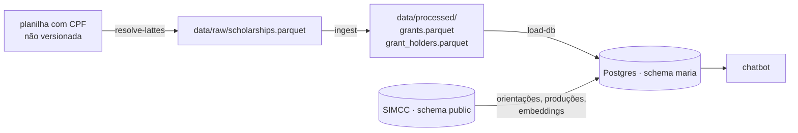

# Pipeline



```bash
poetry run resolve-lattes ENTRADA.xlsx data/raw/scholarships.parquet   # só quando chegar planilha nova com CPF
poetry run ingest      # scholarships.parquet → grants.parquet + grant_holders.parquet
poetry run load-db     # parquet + SIMCC → schema maria (tabelas, embeddings, ligações, funções)
```

## 1. `resolve-lattes`: CPF → Lattes

`src/simcc_maria/resolve_lattes.py`

- **Troca o CPF pelo Lattes ID** pela API do SIMCC (`getIdentificadorCNPq`),
  com **uma requisição por CPF distinto**.
- **Cache local** em `data/cache/`, indexado pelo SHA-256 do CPF. **Apague o
  cache depois da conversão**: um hash de CPF pode ser revertido por força
  bruta.
- **Mascara CPF e RG digitados em texto livre**, como `[CPF removido]` e
  `[RG removido]`.
- **Renomeia as colunas** para o padrão do repositório.

A conversão de 05/10/2026 está relatada no `README.md`: 45.317 de 45.425
linhas (99,8%) com Lattes.

## 2. `ingest`: modelo de bolsas

`src/simcc_maria/ingest.py`

1. **Lê `scholarships.parquet`**, converte textos vazios em nulo e datas
   `dd/mm/aaaa` em `date`, e traduz a modalidade para código.
2. **Junta linhas idênticas** e guarda a contagem em `source_rows`.
3. **Cria o `grant_id`** com o hash de título + resumo normalizados,
   modalidade, sigla da instituição e data final prevista.
4. **Gera um bolsista por (bolsa, Lattes).** Registros sem Lattes viram um
   bolsista cada.
5. **Grava** `grants.parquet` e `grant_holders.parquet` em `data/processed/`.
   Esses arquivos não são versionados e podem ser regenerados a qualquer
   momento.

Os testes em `tests/test_core.py` cobrem as regras de identidade:
segundo bolsista no mesmo ciclo, novo ciclo, duplicatas, bolsista sem Lattes, e
modalidade ou instituição diferentes.

## 3. `load-db`: schema `maria`

`src/simcc_maria/load_db.py`. Grava **somente** no schema `maria`; as
tabelas do SIMCC (`public`) são só lidas.

1. **Embeddings** (`text-embedding-3-small`, o mesmo modelo do SIMCC), em
   cache em `maria.embedding_cache`:
    - título de cada bolsa, para a ligação com orientações;
    - título + resumo + palavras-chave, para a busca temática;
    - títulos das orientações de IC, mestrado e doutorado do SIMCC.
2. **`maria.grants` e `maria.grant_holders`**, carregadas via `COPY`.
3. **`maria.productions`**: artigos, livros e capítulos do SIMCC, com
   `work_key`.
4. **`maria.grant_advisor_links`**: ligação bolsa → orientador, por
   similaridade lexical **ou** semântica dos títulos (veja
   [SIMCC](simcc.md)).
5. **View `maria.grant_researchers`** e as **funções de busca híbrida**.

A primeira execução gera cerca de 225 mil embeddings (~25 milhões de tokens,
~US$ 0,50). As seguintes reaproveitam o cache.

### Etapas e retomada

| Etapa | O que faz | Tempo (com cache) |
|---|---|---|
| `tables` | embeddings das bolsas, `grants`, `grant_holders`, `guidance_titles`, `productions` | ~3 min |
| `guidance` | embeddings dos títulos de orientação | segundos |
| `vectors` | tabela de vetores das orientações + índice HNSW (em memória, 2 GB) | ~6 min |
| `links` | ligações bolsa → orientador, em lotes de 1.000 bolsas | ~13 min |
| `finalize` | view `grant_researchers` e funções de busca | segundos |

```bash
poetry run load-db                        # tudo
poetry run load-db --from links           # refaz as ligações (ex.: mudou LINK_*)
poetry run load-db --from links --resume  # continua ligações interrompidas
poetry run load-db --from finalize        # recria funções (ex.: mudou THEME_*)
```

Cada lote de ligações é uma transação, e `maria.grant_link_progress` registra
as bolsas já processadas. As conexões usam `client_connection_check_interval`:
se o processo morrer, o Postgres aborta a consulta em vez de deixá-la órfã
segurando bloqueios.

!!! note "Docker e `/dev/shm`"
    O container `simcc-db-1` usa o `/dev/shm` padrão (64 MB), pequeno demais
    para construir o índice HNSW com workers paralelos. As etapas pesadas
    rodam com `max_parallel_maintenance_workers = 0` e
    `max_parallel_workers_per_gather = 0`.

## Parâmetros (`.env`)

As linhas de corte e os pesos da busca híbrida ficam em
`src/simcc_maria/config.py` e podem ser sobrescritos por variável de
ambiente. Depois de mudar `LINK_*`, rode `load-db --from links`; depois de
mudar `THEME_*` ou `OUTCOME_*`, rode `load-db --from finalize`.

| Variável | Padrão | Uso |
|---|---|---|
| `THEME_LEXICAL_MIN` | 1.0 | Busca temática: o termo precisa aparecer no texto |
| `THEME_SEMANTIC_MIN` | 0.40 | Busca temática: similaridade de cosseno mínima |
| `THEME_LEXICAL_WEIGHT` / `THEME_SEMANTIC_WEIGHT` | 0.5 / 0.5 | Peso de cada método no `match_score` |
| `LINK_LEXICAL_MIN` | 0.80 | Ligação com orientador: similaridade de trigramas (`pg_trgm`) mínima entre títulos |
| `LINK_SEMANTIC_MIN` | 0.90 | Ligação com orientador: similaridade de cosseno mínima entre títulos |
| `LINK_LEXICAL_WEIGHT` / `LINK_SEMANTIC_WEIGHT` | 0.5 / 0.5 | Peso de cada método no `link_score` |
| `LINK_YEARS_BEFORE` / `LINK_YEARS_AFTER` | 1 / 2 | Ano da orientação entre (início − 1) e (fim previsto + 2) |
| `LINK_CANDIDATES` | 20 | Vizinhos mais próximos (HNSW) avaliados por bolsa, além do título idêntico |
| `OUTCOME_YEARS_AFTER` | 3 | Produção conta como resultado até 3 anos após o fim da bolsa |
